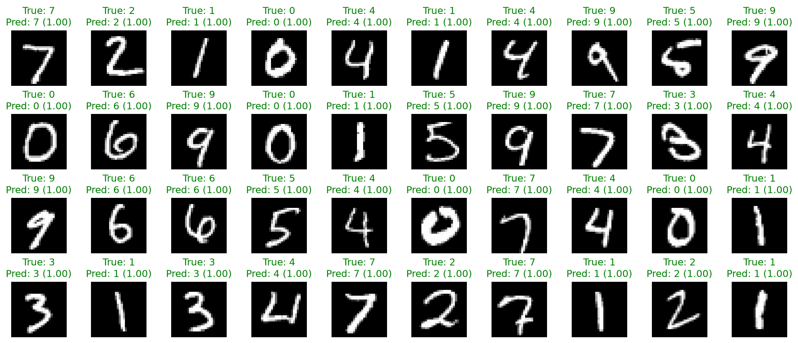

# Handwritten Digit Classifier

This project trains a neural network to classify handwritten digits from the
MNIST dataset. It was built step by step to practice the core deep learning
workflow: loading data, defining a model, training, evaluating, saving weights,
and running inference on unseen examples.

## Result

The final saved model reached:

```text
Test Loss: 0.1278
Test Accuracy: 0.9791
```

## Inference Preview

The image below shows a batch of 40 test predictions. Green titles are correct
predictions, and red titles are mistakes.



## Dataset

The project uses MNIST, a dataset of grayscale handwritten digit images.

Each image has shape:

```text
[1, 28, 28]
```

During training, images are grouped into batches:

```text
[batch_size, 1, 28, 28]
```

The data pipeline applies:

```text
ToTensor
Normalize(mean=0.1307, std=0.3081)
```

Normalization centers and scales the pixel values so the neural network can
learn more smoothly.

## Model

The final model is a small multilayer perceptron:

```text
Flatten
Linear: 784 -> 256
ReLU
Linear: 256 -> 128
ReLU
Linear: 128 -> 10
```

Tensor shape flow:

```text
input image batch: [batch_size, 1, 28, 28]
after flatten:     [batch_size, 784]
hidden layer 1:    [batch_size, 256]
hidden layer 2:    [batch_size, 128]
output logits:     [batch_size, 10]
```

The 10 output values are class scores for digits `0` through `9`.

## Training

Training uses:

```text
Loss: CrossEntropyLoss
Optimizer: Adam
Epochs: 20
Batch size: 32
Device: CUDA, MPS, or CPU
```

The training loop evaluates on the validation set after each epoch. After all
epochs finish, the model is evaluated once on the test set and saved to:

```text
models/digit_classifier.pt
```

## Inference

The inference script loads the saved model weights, predicts a batch of 40 test
images, and saves the visualization to:

```text
outputs/inference_batch.png
```

## Commands

Train the model:

```bash
uv run --package handwritten-digit-classifier python handwritten-digit-classifier/train.py
```

Run inference and save the prediction image:

```bash
uv run --package handwritten-digit-classifier python handwritten-digit-classifier/inference.py
```

## What I Learned

- How MNIST images move through a PyTorch `DataLoader`.
- Why tensors use shapes like `[batch_size, channels, height, width]`.
- How `CrossEntropyLoss` compares logits against class labels.
- Why `model.train()` and `model.eval()` matter.
- How validation differs from final test evaluation.
- How `ReLU` lets a network learn nonlinear patterns.
- How to save and reload trained model weights.
- How to inspect predictions visually instead of trusting only numbers.

## Next Direction

The next major improvement would be a convolutional neural network. A CNN is a
better fit for image data because it learns local visual patterns like strokes,
edges, and curves before making a digit prediction.
