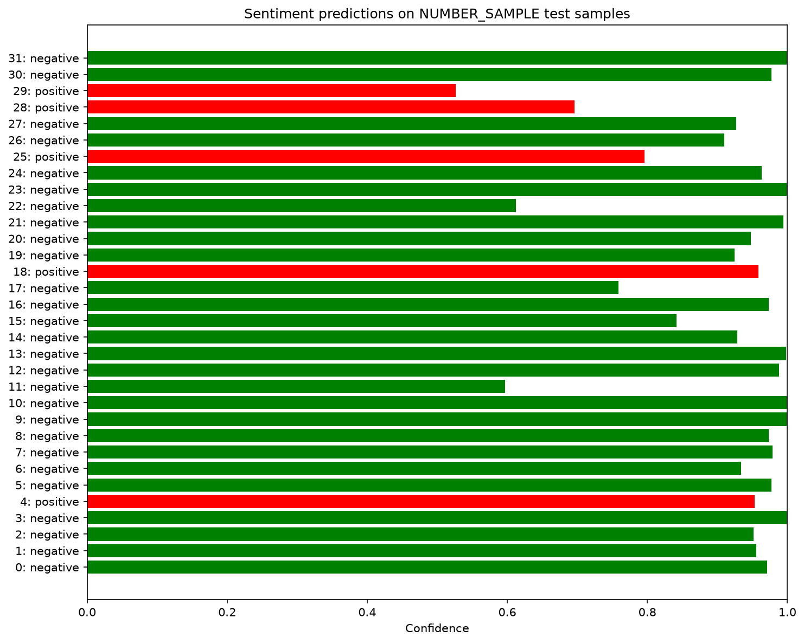

# Sentiment Classifier

This project trains a neural network to classify IMDb movie reviews as
negative or positive. It was built step by step to practice the core NLP deep
learning workflow: loading text data, tokenizing reviews, building a
vocabulary, creating embeddings, training a classifier, evaluating it, saving
weights, and running inference on unseen reviews.

## Result

The best recorded mean-pooling baseline reached:

```text
Test Loss: 0.2975
Test Accuracy: 0.8877
```

The current LSTM model improved after fixing the padded-sequence final-state
selection, but still trails the simpler baseline:

```text
Test Loss: 0.4352
Test Accuracy: 0.8559
```

The 30-epoch LSTM run overfit: training loss kept falling, while validation and
test loss became worse.

## Inference Preview

The inference script evaluates the saved model on the test set, writes a text
report for sample predictions, and saves a confidence chart.



```text
outputs/sentiment_predictions.txt
```

## Dataset

The project uses the IMDb movie review dataset from Hugging Face:

```text
stanfordnlp/imdb
```

Each example contains:

```text
text:  raw movie review
label: 0 for negative, 1 for positive
```

Reviews have different lengths, so each batch is padded to the longest review
in that batch.

```text
input_ids: [batch_size, sequence_length]
labels:    [batch_size]
```

## Text Pipeline

The data pipeline applies a simple tokenizer:

```text
lowercase text
replace <br /> tags
remove punctuation
split on whitespace
map tokens to vocabulary ids
pad shorter reviews with <pad>
```

The vocabulary reserves:

```text
<pad> -> 0
<unk> -> 1
```

Unknown words are mapped to `<unk>`, and padded positions are mapped to
`<pad>`.

## Model

The first strong baseline used embedding plus mean pooling:

```text
Embedding
Mean over sequence length
Linear: embedding_dim -> 2
```

Tensor shape flow:

```text
input ids:       [batch_size, sequence_length]
after embedding: [batch_size, sequence_length, embedding_dim]
after pooling:   [batch_size, embedding_dim]
output logits:   [batch_size, 2]
```

The current model uses an LSTM:

```text
Embedding
LSTM
Select final real token state
Linear: hidden_dim -> 2
```

Tensor shape flow:

```text
input ids:           [batch_size, sequence_length]
after embedding:     [batch_size, sequence_length, 64]
LSTM output:         [batch_size, sequence_length, 128]
real token lengths:  [batch_size]
final hidden state:  [batch_size, 128]
output logits:       [batch_size, 2]
```

The important LSTM fix is selecting the output at each review's last real token
instead of using the hidden state after padded positions.

## Training

Training uses:

```text
Loss: CrossEntropyLoss
Optimizer: Adam
Batch size: 32
Device: CUDA, MPS, or CPU
```

The training loop evaluates on the validation set after each epoch. After all
epochs finish, the model is evaluated once on the test set and saved to:

```text
models/sentiment-classifer.pt
```

## Inference

The inference script loads the saved model weights, predicts sentiment for test
reviews, calculates test accuracy, and writes sample predictions to:

```text
outputs/sentiment_predictions.txt
```

It also saves a confidence chart to:

```text
outputs/inference_batch.png
```

## Commands

Train the model:

```bash
uv run --package sentiment-classifier python sentiment-classifier/train.py
```

Run inference and save the prediction outputs:

```bash
uv run --package sentiment-classifier python sentiment-classifier/inference.py
```

## Experiment Tracks

### 2026-06-24: Train Mean-Pooling Baseline Longer

1 epoch:

```text
Train Loss: 0.6580, Val Loss: 0.5904, Val Accuracy: 0.7832
Test Accuracy: 0.7667
```

5 epochs:

```text
Train Loss: 0.2730, Val Loss: 0.3034, Val Accuracy: 0.8904
Total training time: 437.59 seconds
Test Accuracy: 0.8783
```

10 epochs:

```text
Epoch [10/10] Train Loss: 0.1673, Val Loss: 0.2748, Val Accuracy: 0.8980
Total training time: 869.88 seconds
Test Loss: 0.2975, Test Accuracy: 0.8877
```

### 2026-06-25: Improve Model Architecture With LSTM

Initial LSTM using `hidden[-1]` performed poorly because padded tokens affected
the final hidden state.

1 epoch:

```text
Total training time: 64.62 seconds
Epoch [1/1] Train Loss: 0.6934, Val Loss: 0.6931, Val Accuracy: 0.4980
```

5 epochs:

```text
Total training time: 289.36 seconds
Epoch [5/5] Train Loss: 0.6862, Val Loss: 0.6916, Val Accuracy: 0.5020
Test Loss: 0.6936, Test Accuracy: 0.5028
```

After fixing the LSTM to use the output at the last real token:

2 epochs:

```text
Total training time: 103.64 seconds
Epoch [2/2] Train Loss: 0.5696, Val Loss: 0.5497, Val Accuracy: 0.7094
Test Loss: 0.5596, Test Accuracy: 0.7018
```

5 epochs:

```text
Epoch [5/5] Train Loss: 0.2964, Val Loss: 0.3976, Val Accuracy: 0.8342
Total training time: 232.64 seconds
Test Loss: 0.4017, Test Accuracy: 0.8312
```

10 epochs:

```text
Epoch [10/10] Train Loss: 0.1156, Val Loss: 0.3855, Val Accuracy: 0.8686
Total training time: 450.74 seconds
Test Loss: 0.4352, Test Accuracy: 0.8559
```

30 epochs:

```text
Epoch [30/30] Train Loss: 0.0029, Val Loss: 0.9435, Val Accuracy: 0.8498
Total training time: 1292.08 seconds
Test Loss: 0.9555, Test Accuracy: 0.8433
```

### 2026-06-26: Try to run with CUDA GPU (Very fast)

30 epochs:
```
NVIDIA GeForce RTX 5060 Ti
Epoch [30/30] Train Loss: 0.0003, Val Loss: 1.0210, Val Accuracy: 0.8614
Total training time: 225.03 seconds
Test Loss: 1.0218, Test Accuracy: 0.8534
```

## What I Learned

- How raw text becomes token ids through tokenization and vocabulary lookup.
- Why batches of text need padding.
- How embeddings turn token ids into learned dense vectors.
- How mean pooling summarizes a review by averaging token embeddings.
- Why mean pooling is a strong baseline but ignores word order.
- How an LSTM reads a sequence and produces hidden states over time.
- Why padded tokens can break sequence models if final states are selected
  incorrectly.
- How validation loss can reveal overfitting even when training loss improves.
- How to compare architectures using the same train, validation, and test
  workflow.

## Next Direction

The next major improvement would be a better sequence model setup: use packed
padded sequences, add dropout, try a bidirectional LSTM or GRU, and compare
against a simple text CNN. After that, the natural next NLP step is attention or
a small Transformer-style classifier.
